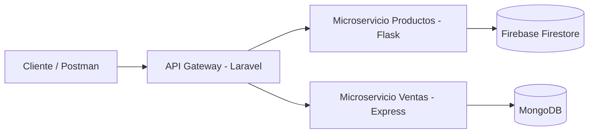

# Sistema de Ventas con Arquitectura de Microservicios

## Descripción

Este proyecto implementa un **sistema de ventas basado en arquitectura de microservicios**.

El sistema permite:

* gestionar productos
* validar stock
* registrar ventas

La aplicación está compuesta por múltiples servicios independientes que se comunican mediante **APIs REST**.

### Tecnologías utilizadas

* **API Gateway:** Laravel (PHP)
* **Microservicio de Productos:** Flask (Python) + Firebase Firestore
* **Microservicio de Ventas:** Node.js + Express + MongoDB
* **Autenticación:** JWT
* **Comunicación entre microservicios:** HTTP REST con token compartido

---

# Arquitectura del Sistema

Cliente → API Gateway → Microservicios

Componentes del sistema:

### API Gateway (Laravel)

Responsabilidades:

* recibir las peticiones del cliente
* autenticación mediante **JWT**
* orquestar la comunicación entre microservicios
* enviar solicitudes a los servicios internos

### Microservicio de Productos (Flask)

Responsabilidades:

* gestión de productos
* validación de stock
* actualización de stock
* almacenamiento en **Firebase Firestore**

### Microservicio de Ventas (Express)

Responsabilidades:

* registro de ventas
* almacenamiento en **MongoDB**

---

# Seguridad

El sistema utiliza dos mecanismos de seguridad:

### 1. JWT para autenticación de usuarios

El **API Gateway** genera tokens JWT cuando un usuario inicia sesión.
Las rutas protegidas requieren enviar el token en el header:

```http
Authorization: Bearer TOKEN
```

---

### 2. Token compartido entre microservicios

Para evitar que cualquier cliente pueda consumir directamente los microservicios, se utiliza un **token interno**.

El API Gateway envía el siguiente header cuando realiza peticiones:

```http
Authorization: TOKEN_APIS
```

Este mismo token debe configurarse en los microservicios.

---

# Requisitos

Para ejecutar el proyecto es necesario tener instalado:

* PHP 8+
* Composer
* Node.js
* npm
* Python 3
* pip
* **MongoDB**
* **Firebase / Firestore**
* Postman o Thunder Client (opcional)

---

# Instalación del Proyecto

## 1. Clonar repositorio

```bash id="8cyrd0"
git clone <URL_DEL_REPOSITORIO>
cd proyecto
```

---

# API Gateway (Laravel)

## Instalación

Entrar al directorio:

```bash id="h9w0xt"
cd api_gateway
```

Instalar dependencias:

```bash id="c5caxg"
composer install
```

Crear archivo `.env`:

```bash id="8tt9kw"
cp .env.example .env
```

---

## Configuración del archivo `.env`

Editar `.env` y agregar:

```id="1t1vps"
TOKEN_APIS=token_microservicios

SALES_ENDPOINT=http://127.0.0.1:3000/api/sales
PRODUCTS_ENDPOINT=http://127.0.0.1:5000/api/products
```

---

## Generar clave de Laravel

```bash id="xbpg72"
php artisan key:generate
```

Esto generará:

```id="mtjjzz"
APP_KEY
```

---

## Generar JWT Secret

El proyecto utiliza autenticación basada en **JWT**.

Ejecutar:

```bash id="47dc3p"
php artisan jwt:secret
```

Esto agregará al `.env`:

```id="7n7zh9"
JWT_SECRET
```

---

## Ejecutar API Gateway

```bash id="a4v52e"
php artisan serve
```

Disponible en:

```id="l2r26y"
http://127.0.0.1:8000
```

---

# Microservicio de Productos (Flask)

Este servicio gestiona productos y el stock utilizando **Firebase Firestore**.

## Instalación

Entrar al directorio:

```bash id="f4g6q6"
cd products_service
```

Instalar dependencias:

```bash id="4knf9f"
pip install -r requirements.txt
```

---

## Configuración

Este microservicio requiere dos configuraciones:

### 1. Credenciales de Firebase

Ir a **Firebase Console → Project Settings → Service Accounts**
Generar una nueva clave privada y descargar el archivo JSON.

Renombrar el archivo como:

```id="mwy5ah"
serviceAccountKey.json
```

Colocarlo dentro del directorio del microservicio.

---

### 2. Archivo `.env`

Crear un archivo `.env` y agregar:

```id="c5tmsi"
PORT=5000
TOKEN_APIS=token_microservicios
```

El valor de **TOKEN_APIS** debe ser el mismo configurado en **Laravel**.

---

## Ejecutar servidor

```bash id="6puphu"
python app.py
```

Servidor disponible en:

```id="g3q4y9"
http://127.0.0.1:5000
```

---

# Microservicio de Ventas (Express)

Este servicio registra las ventas y utiliza **MongoDB**.

## Instalación

Entrar al directorio:

```bash id="p7izd5"
cd sales_service
```

Instalar dependencias:

```bash id="8ctb8h"
npm install
```

---

## Configuración de variables de entorno

Crear archivo `.env`:

```id="d0qs7s"
PORT=3000
DATABASE_URL=mongodb://localhost:27017/sales_db
TOKEN_APIS=token_microservicios
```

Variables:

* **PORT:** puerto del servidor
* **DATABASE_URL:** conexión a MongoDB
* **TOKEN_APIS:** token usado para validar peticiones desde el gateway

El valor de **TOKEN_APIS** debe ser el mismo que el configurado en Laravel.

---

## Ejecutar MongoDB

Antes de iniciar el servicio asegúrate de que MongoDB esté ejecutándose.

Ejemplo:

```bash id="glbe8y"
mongod
```

---

## Ejecutar servidor

```bash id="5ol3ga"
node app.js
```

Servidor disponible en:

```id="mccm1o"
http://127.0.0.1:3000
```

---

# Documentación de Endpoints (API Gateway)

Estos son los endpoints que deben consumir los clientes.

---

# Autenticación

### Registrar usuario

POST `/api/register`

Body:

```json id="vds1va"
{
 "name": "Usuario",
 "email": "usuario@email.com",
 "password": "123456"
}
```

---

### Login

POST `/api/login`

Body:

```json id="1gq20v"
{
 "email": "usuario@email.com",
 "password": "123456"
}
```

Respuesta:

```json id="3s3d1k"
{
 "token": "JWT_TOKEN"
}
```

---

### Logout

POST `/api/logout`

Header:

```http
Authorization: Bearer TOKEN
```

---

# CRUD Productos

### Obtener productos

GET `/api/products`

---

### Crear producto

POST `/api/products`

Body:

```json id="prp7m9"
{
 "name": "Producto",
 "price": 100,
 "stock": 10,
 "category": "categoria"
}
```

---

### Actualizar producto

PUT `/api/products/{id}`

Body:

```json id="y2wr02"
{
 "name": "Producto actualizado",
 "price": 120,
 "stock": 5,
 "category": "categoria"
}
```

---

### Eliminar producto

DELETE `/api/products/{id}`

---

# CRUD Ventas

### Obtener ventas

GET `/api/sales`

---

### Crear venta

POST `/api/sales`

Body:

```json id="0m7fjr"
{
 "product_id": "ID_PRODUCTO",
 "quantity": 2,
 "total": 200
}
```

Proceso interno:

1. Validar stock en microservicio de productos
2. Crear venta en microservicio de ventas
3. Descontar stock

---

### Actualizar venta

PUT `/api/sales/{id}`

Body:

```json id="5fja6u"
{
 "quantity": 3,
 "total": 300
}
```

---

### Eliminar venta

DELETE `/api/sales/{id}`

---

# Pruebas

Se recomienda usar **Postman** o **Thunder Client**.

Ejemplo:

```http
POST http://127.0.0.1:8000/api/sales
```

El cliente debe interactuar **únicamente con el API Gateway**.

---

# Autor

Proyecto académico desarrollado como práctica de **arquitectura de microservicios** utilizando:

* Laravel
* Flask
* Express
* MongoDB
* Firebase Firestore

## Arquitectura del sistema

